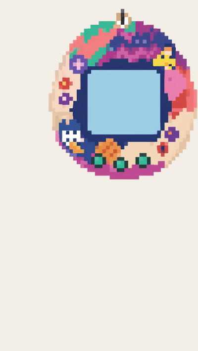

## Choose the case

### Step 1
Click on the Image gallery tab and choose a background image for the case.

### Step 2
In the **index.html** add a `<section>` for the case.

--- code ---
---
language: html
filename: index.html
line_numbers: true
line_number_start: 10
line_highlights: 10-12
---
  <section class="case">

  </section>
--- /code ---

### Step 3
Add an `` with the name of the case you have chosen. 

In the example, this is `src="bg3.png"`.

--- code ---
---
language: html
filename: index.html
line_numbers: true
line_number_start: 10
line_highlights: 10-12
---
  <section class="case">
    
  </section>
--- /code ---

> ### Tip
> 
> `alt="device case"` is alt text, which is used by screen readers or if there is an issue with the image showing.
{: .c-project-callout .c-project-callout--tip}

### Now run your code
See the device case you chose.

