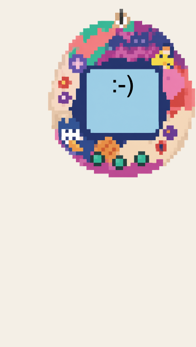

## Create a function

Add a JavaScript function to change your pet's face.

### Step 1
Open `script.js` in the project file tab.

### Step 2
Add this function, which changes the face if the happiness is below 50.

Instead of the smiley and sad faces, add your own emojis.

--- code ---
---
language: javascript
filename: script.js
line_numbers: true
line_number_start: 1
line_highlights: 1-12
---
// Store how happy your pet is.
let happiness = 70;

const face = document.getElementById("face");

const mood = () => {
  if (happiness >= 50) {
    face.textContent = ":-)";
  } else {
    face.textContent = ":-(";
  }
};
--- /code ---

### Step 3
Add `setInterval()` to decrease the happiness level by 5 every 3 seconds. 

> ### Tip
>
> `setInterval()` is a JavaScript command that works like a timer.
> 
> - `-= 5` decreases the happiness level by 5
> - `3000` milliseconds means 3 seconds

--- code ---
---
language: javascript
filename: script.js
line_numbers: true
line_number_start: 14
line_highlights: 14-17
---
setInterval(() => {
  happiness -= 5;
  mood();
}, 3000);
--- /code ---

### Now run your code
See the face change over time. 

Change the timer so that it changes with the speed you want it to.

