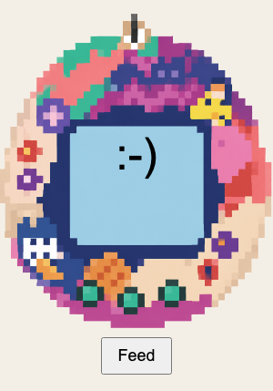

## Add a feed button

In the **index.html** file, make a button to interact with the pet.

--- code ---
---
language: html
filename: index.html
line_numbers: true
line_number_start: 10
line_highlights: 13, 16
---
  <section class="case">
    
    
:-)

    

  </section>

  <button id="feed">Feed</button>
</body>
--- /code ---

### Now run your code
See the button appear below the case. 

The button here is to "feed". Change the text on the button depending on what you want it to do. 

