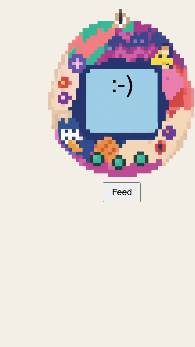

## Make the button work

In `script.js` increase your pet's happiness when the button is clicked.

--- code ---
---
language: javascript
filename: script.js
line_numbers: true
line_number_start: 14
line_highlights: 14-19
---
const feed = document.getElementById("feed");

feed.addEventListener("click", () => {
  happiness += 10;
  mood();
});
--- /code ---

### Now run your code
Click the button to see the pet change.

