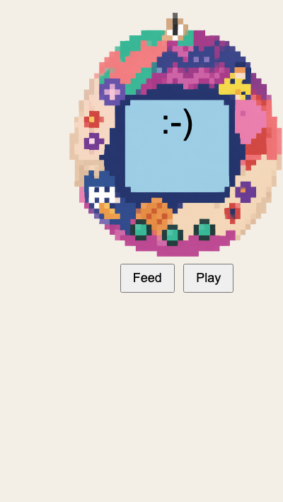

## Challenge: add another mood

Give your pet three different moods for three happiness levels.

Add to the `mood()` function in `script.js` with this code.

--- code ---
---
language: javascript
filename: script.js
line_numbers: true
line_number_start: 6
line_highlights: 7-13
---
const mood = () => {
  if (happiness >= 80) {
    face.textContent = ":-D";
  } else if (happiness >= 50) {
    face.textContent = ":-)";
  } else {
    face.textContent = ":-(";
  }
};
--- /code ---

### Now run your code
Run your code to see the other faces. Change the faces with other moods to suit your pet.

